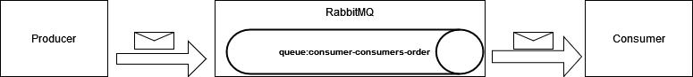
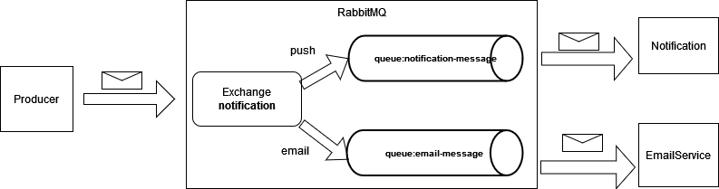

# NET5-Microservices-Using-MassTransit
Example: .NET 5 Microservices using MassTransit

### Requirements
+ Install .NET5
+ Install Docker & Docker Compose
    - RabbitMQ Server Dashboard(http://localhost:15672/)

### Structure
+ Producer: using the API sends messages
+ Consumer: receive messages from Queue(consumer-consumers-order)
+ Notification: receive messages with Exchange Topic=push
+ EmailService: receive message with Exchange Topic=email

### Overview
+ Direct Queue

    


+ Topic

    

### Usages:
+ Start RabbitMQ Server
    ```
    cd DemoMicroservices
    docker-compose up
    ```
+ Start multi apps with Visual Studio

Run Producer: http://localhost:22270/swagger/index.html
+ Send a message to Queue(consumer-consumers-order), Run post Order API
    ```
    http://localhost:22270/Order

    ```

    ```
    http://localhost:22270/Notification
    ```

### References
+ [Setting Up MassTransit and RabbitMQ](https://wrapt.dev/blog/building-an-event-driven-dotnet-application-setting-up-masstransit-and-rabbitmq)
+ [RabbitMQ with ASP.NET Core – Microservice Communication with MassTransit](https://codewithmukesh.com/blog/rabbitmq-with-aspnet-core-microservice/)
